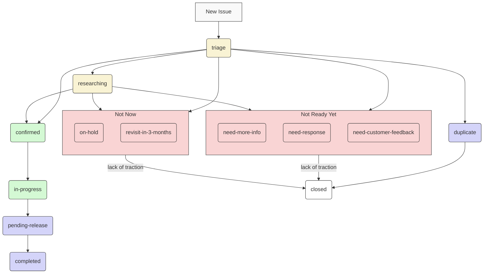

# Maintainers Playbook

Playbook for active maintainers of the project and new contributors. Test input.

## Overview

> [!Note]
> This is a living document and will be updated as the project evolves.

This document explains who the maintainers are, their responsibilities, and how they should be doing it. If you're interested in contributing, see the [contributing](https://github.com/aws-powertools/powertools-mcp/blob/chore/main/CONTRIBUTING.md) document.

## Current Maintainers

| Maintainer     | GitHub ID                                                                   | Affiliation |
| -------------- | --------------------------------------------------------------------------- | ----------- |
| Andrea Amorosi | [dreamorosi](https://github.com/dreamorosi){target="_blank" rel="nofollow"} | Amazon      |
| Henrique Graca | [hjgraca](https://github.com/hjgraca){target="_blank" rel="nofollow"}       | Amazon      |
| Stefano Vozza  | [svozza](https://github.com/svozza){target="_blank" rel="nofollow"}         | Amazon      |

### Emeritus

Previous active maintainers who contributed to this project.

| Maintainer       | GitHub ID                                                               | Affiliation |
| ---------------- | ----------------------------------------------------------------------- | ----------- |
| Michael Walmsley | [walmsles](https://github.com/walmsles){target="_blank" rel="nofollow"} | Accenture   |

## Issue Types

| Type        | Description                                                                                          |
| ----------- | ---------------------------------------------------------------------------------------------------- |
| Bug         | Issue representing a bug in the MCP server code, see [Is that a bug?](#is-that-a-bug) for details.   |
| Enhancement | Issue representing a new feature or enhancement to the MCP server code.                              |
| Task        | Issue representing a task that needs to be done, such as documentation updates or maintenance tasks. |

## Issue Status Labels

These are the most common labels used by maintainers to categorize the status of issues. They help maintainers and contributors understand the current state of an issue at a glance.

| Type                   | Description                                                             |
| ---------------------- | ----------------------------------------------------------------------- |
| triage                 | Issue is new and requires maintainers review.                           |
| researching            | Issue is being investigated but not yet confirmed for the backlog.      |
| confirmed              | Issue is on the backlog and ready for work.                             |
| in-progress            | Issue is being worked on by a maintainer or contributor.                |
| pending-release        | Issue is completed and waiting to be released.                          |
| completed              | Issue is completed and released.                                        |
| on-hold                | Issue is on hold and requires further discussion.                       |
| need-response          | Issue requires a response from the author or customer.                  |
| need-customer-feedback | Issue requires feedback from one or more customers to reach consensus.  |
| need-more-info         | Issue requires more information before it's added to the backlog.       |
| revisit-in-3-months    | Issue is not a priority right now, but should be revisited in 3 months. |
| duplicate              | Issue is a duplicate of another issue and will be closed.               |
| rejected               | Issue is closed due to lack of traction or being a duplicate.           |

The following diagram illustrates the issue triage workflow and the most common states an issue can be in:

## Other Labels

These are some of the other labels that can be applied to issues and pull requests. They help maintainers and contributors understand the context of an issue or pull request, and how it relates to the project.

| Label                           | Usage                                                                                                                 |
| ------------------------------- | --------------------------------------------------------------------------------------------------------------------- |
| not-a-bug                       | Issue is not a bug, but rather an intended behavior or a feature request.                                             |
| help-wanted                     | Issue is seeking help from the community.                                                                             |
| good-first-issue                | Issue is a good first issue for new contributors.                                                                     |
| bug-upstream                    | Issue is a bug in an upstream dependency and needs to be reported upstream.                                           |
| need-issue                      | PR is missing a linked issue and might be closed if not addressed.                                                    |
| pending-close-response-required | Issue is pending a response from the author or customer and will be closed if no response is received within 1 weeks. |
| breaking-change                 | Issue or PR that introduces a breaking change and requires careful review.                                            |
| automation                      | Issue or PR that is related to automation, such as CI/CD workflows or scripts.                                        |
| size/XS                         | PR between 0-9 LOC                                                                                                    |
| size/S                          | PR between 10-29 LOC                                                                                                  |
| size/M                          | PR between 30-99 LOC                                                                                                  |
| size/L                          | PR between 100-499 LOC                                                                                                |
| size/XL                         | PRs between 500-999 LOC, often PRs that grown with feedback                                                           |
| size/XXL                        | PRs with 1K+ LOC, largely documentation related or tooling changes that cause large diffs                             |

## Maintainer Responsibilities

Maintainers are active and visible members of the community, and have [maintain-level permissions on a repository](https://docs.github.com/en/organizations/managing-access-to-your-organizations-repositories/repository-permission-levels-for-an-organization){target="_blank" rel="nofollow"}. Use those privileges to serve the community and evolve code as follows.

Be aware of recurring ambiguous situations and [document them](#common-scenarios) to help your fellow maintainers.

### Uphold Code of Conduct

Model the behavior set forward by the [Code of Conduct](https://github.com/aws-powertools/powertools-mcp/blob/chore/main/CODE_OF_CONDUCT.md){target="_blank"} and raise any violations to other maintainers and admins. There could be unusual circumstances where inappropriate behavior does not immediately fall within the [Code of Conduct](https://github.com/aws-powertools/powertools-mcp/blob/chore/main/CODE_OF_CONDUCT.md){target="_blank"}.

These might be nuanced and should be handled with extra care - when in doubt, do not engage and reach out to other maintainers and admins.

### Prioritize Security

Security is your number one priority. Maintainer's Github keys must be password protected securely and any reported security vulnerabilities are addressed before features or bugs.

Note that this repository is monitored and supported 24/7 by Amazon Security, see [Reporting a Vulnerability](https://github.com/aws-powertools/powertools-mcp/blob/main/SECURITY.md){target="_blank"} for details.

### Review Pull Requests

Review pull requests regularly, comment, suggest, reject, merge and close. Accept only high quality pull-requests. Provide code reviews and guidance on incoming pull requests.

PRs are [labeled](#other-labels) based on status, content, and use semantic titles. Pay attention to whether labels reflect the current state of the PR and update accordingly.

Use and enforce [semantic versioning](https://semver.org/) pull request titles, as these will be used for versioning and the changelog, as well as [release notes](https://github.com/aws-powertools/powertools-mcp/releases) - make sure they communicate their intent at the human level.

For issues linked to a PR, make sure `pending-release` label is applied to them when merging. [Upon release](#releasing-a-new-version), these issues will be updated with the release version that contains the changes in the PR.

See [Common scenarios](#common-scenarios) section for additional guidance.

### Triage New Issues

Manage [labels](#issue-status-labels), review issues regularly, and create new labels as needed by the project. Remove `triage` label when you're able to confirm the validity of a request, a bug can be reproduced, etc. Give priority to the original author for implementation, unless it is a sensitive task that is best handled by maintainers.

Make sure issues are categorized according to our [issue type definition](#issue-types) and have the right [status](#issue-status-labels).

Use our [labels](#other-labels) to signal good first issues to new community members, and to set expectation that this might need additional feedback from the author, other customers, experienced community members and/or maintainers.

Be aware of [casual contributors](https://opensource.com/article/17/10/managing-casual-contributors) and recurring contributors. Provide the experience and attention you wish you had when you were starting in open source.

See [Common scenarios](#common-scenarios) section for additional guidance.

### Triage Bug Reports

Be familiar with [our definition of bug](#is-that-a-bug). If it's not a bug, you can close it or adjust its title and labels - always communicate the reason accordingly.

For bugs caused by upstream dependencies, replace `bug` with `bug-upstream` label. Ask the author whether they'd like to raise the issue upstream or if they would prefer us to do so.

Assess the impact and make the call on whether we need an emergency release. Contact other [maintainers](#current-maintainers) when in doubt.

See [Common scenarios](#common-scenarios) section for additional guidance.

### Triage RFCs

An RFC is a collaborative process to help us get to the most optimal solution given the context. Their purpose is to ensure everyone understands what this context is, the trade-offs, and alternative solutions that were part of the research before implementation begins.

Make sure you ask these questions in mind when reviewing:

- Does it use our [RFC template](https://github.com/aws-powertools/powertools-mcp/discussions/new?category=rfcs)?
- Does the proposal address the use case? If so, is the recommended usage explicit?
- Does it focus on the mechanics to solve the use case over fine-grained implementation details?
- Can anyone familiar with the code base implement it?
- If approved, is the author interested in contributing? Do they need any guidance?
- Does this significantly increase the overall project maintenance? Do we have the skills to maintain it?
- If we can't take this use case, are there alternative projects we could recommend? Or does it call for a new project altogether?

When necessary, be upfront that the time to review, approve, and implement an RFC can vary - see [Contribution is stuck](#contribution-is-stuck). Some RFCs may be further updated after implementation, as certain areas become clearer.

Here's an example of RFC with good engagement from the community: [aws-powertools/powertools-lambda-typescript#3500](https://github.com/aws-powertools/powertools-lambda-typescript/discussions/3500).

### Releasing a new version

Whenever a new version is ready to be released, follow these steps:

1. Run the **Make Version** workflow to bump the version in the `package.json` file and update the `CHANGELOG.md` file. This will create a new commit and open a pull request with the changes.
2. Review the pull request, make sure the version is correct, and that the `CHANGELOG.md` file reflects the changes made in the new version. If necessary, update the pull request with amendments to the `CHANGELOG.md` file or version number.
3. Once the pull request is approved, merge it into the `main` branch.
4. Run the **Make Release** workflow to create a new release. This will publish the new version to `npm` and create a new tag in the repository.
5. Draft the release notes on the [Releases page](https://github.com/aws-powertools/powertools-mcp/releases) - see [Drafting release notes](#drafting-release-notes) for details.

#### Drafting release notes

Visit the [Releases page](https://github.com/aws-powertools/powertools-mcp/releases) and choose the edit pencil button.

Make sure the `tag` field reflects the new version you're releasing, the target branch field is set to `main`, and `release title` matches your tag e.g., `v1.14.1`.

You'll notice we group all changes based on their [type](#issue-types) like `Enhancement`, `Bug`, `Task`, etc.

**I spotted a typo or incorrect grouping - how do I fix it?**

Edit the respective PR title and update their labels. Then run the [Release Drafter workflow](https://github.com/aws-powertools/powertools-lambda-typescript/**actions**/workflows/release-drafter.yml) to update the Draft release.

!!! note
    This won't change the CHANGELOG as the merge commit is immutable. Don't worry about it. We'd rewrite git history only if not doing so can lead to confusion and this should be done by pairing with another maintainer.

**All looking good, what's next?**

The best part comes now. Replace the placeholder `[Human readable summary of changes]` with what you'd like to communicate to customers that this release is all about. Rule of thumb: always put yourself in the customers shoes.

These are some questions to keep in mind when drafting your first or future release notes:

- Can customers understand at a high level what changed in this release?
- Is there a link to the documentation where they can read more about each main change?
- Are there any graphics or [code snippets](https://carbon.now.sh/) that can enhance readability?
- Are we calling out any key contributor(s) to this release?

Once you're happy, hit `Publish release` 🎉🎉🎉.

This will kick off the post-release automations and within a few minutes you should see all issues labeled as `pending-release`  notified of the new release and labeled as `completed`.

### Maintain Overall Health of the Repo

Keep the `main` branch at production quality at all times. Backport features as needed. Create release branches and tags to enable future patches.

### Add Continuous Integration Checks

Add integration checks that validate pull requests and pushes to ease the burden on Pull Request reviewers. Continuously revisit areas of improvement to reduce operational burden in all parties involved.

### Negative Impact on the Project

Actions that negatively impact the project will be handled by the admins, in coordination with other maintainers, in balance with the urgency of the issue. Examples would be [Code of Conduct](https://github.com/aws-powertools/powertools-mcp/blob/main/CODE_OF_CONDUCT.md)
{target="_blank"} violations, deliberate harmful or malicious actions, spam, monopolization, and security risks.

## Common scenarios

These are recurring ambiguous situations that new and existing maintainers may encounter. They serve as guidance. It is up to each maintainer to follow, adjust, or handle in an appropriate manner as long as [our conduct is consistent](#uphold-code-of-conduct)

### Contribution is stuck

A contribution can get stuck often due to lack of bandwidth and/or language barriers. For bandwidth issues, check whether the author needs help. Make sure you get their permission before pushing code into their existing PR - do not create a new PR unless strictly necessary.

In the case of a language barrier or other issues, offer a 1:1 chat to get them unblocked. Often times, English might not be their primary language, and writing in public might put them off, or come across not the way they intended to be.

In some cases, you may have constrained capacity. Use the `help-wanted` label when you want to signal oto ther maintainers and external contributors that you could use a hand to move it forward.

### Insufficient feedback or information

When in doubt, use the `need-more-info` or `need-customer-feedback` labels to signal more context and feedback are necessary before proceeding. You can also use `revisit-in-3-months` label when you expect it might take a while to gather enough information before you can decide.

Note that issues marked as `need-response` will be automatically closed after 3 weeks of inactivity.

### Crediting contributions

We credit all contributions as part of each [release note](https://github.com/aws-powertools/powertools-mcp/releases){target="_blank"} as an automated process. If you find contributors are missing from the release note you're producing, please add them manually.

### Is that a bug?

A bug produces incorrect or unexpected results at runtime that differ from its intended behavior. Bugs must be reproducible. They directly affect customers experience at runtime despite following its recommended usage.

Documentation snippets, use of internal components, CI workflows, or unadvertised functionalities are not considered bugs but rather maitenance tasks.

### Mentoring contributions

Always favor mentoring issue authors to contribute, unless they're not interested or the implementation is sensitive (_e.g., complexity, time to release, etc._).

Make use of `help-wanted` and `good-first-issue` to signal additional contributions the community can help.

### Long running issues or PRs

Try offering a 1:1 call in the attempt to get to a mutual understanding and clarify areas that maintainers could help.

In the rare cases where both parties don't have the bandwidth or expertise to continue, it's best to use the `on-hold` or `revisit-in-3-months` labels. After some time has passed, see if it's possible to break the PR or issue into smaller chunks, and eventually close if there is no progress.
